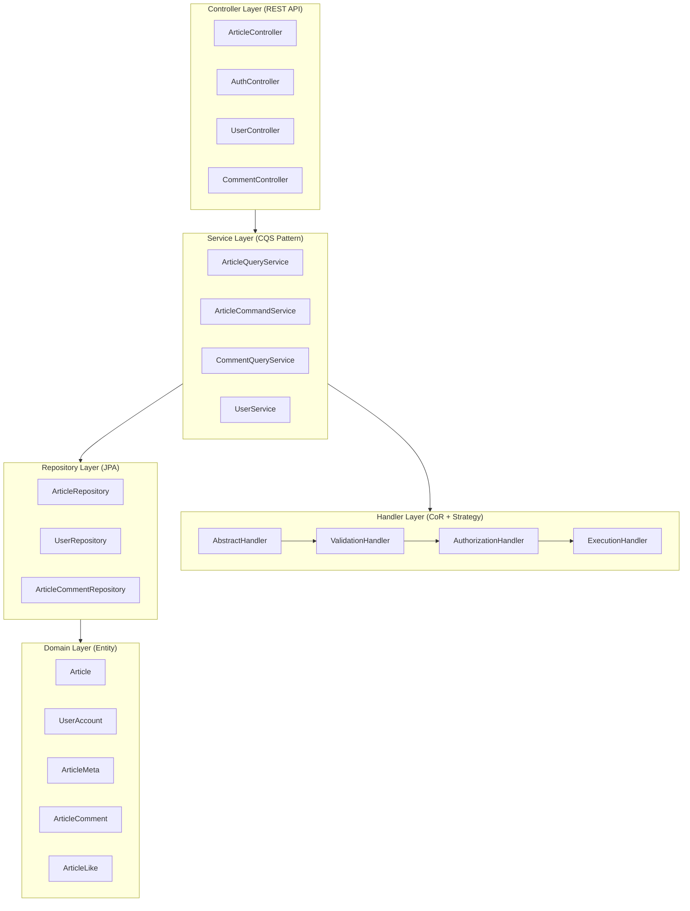
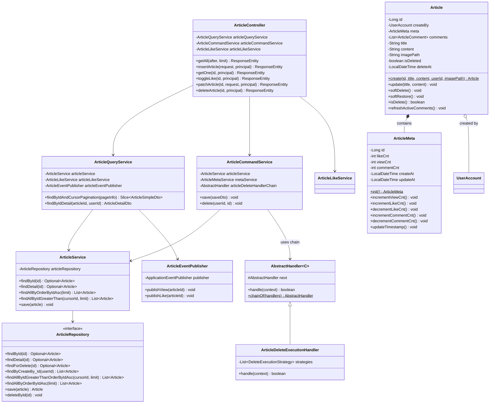
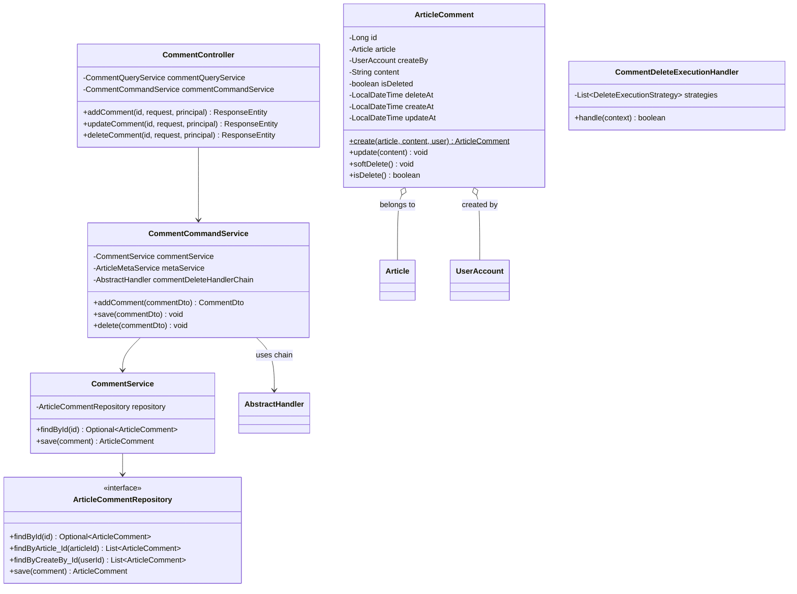
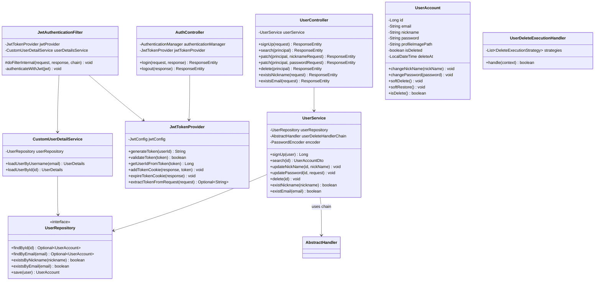
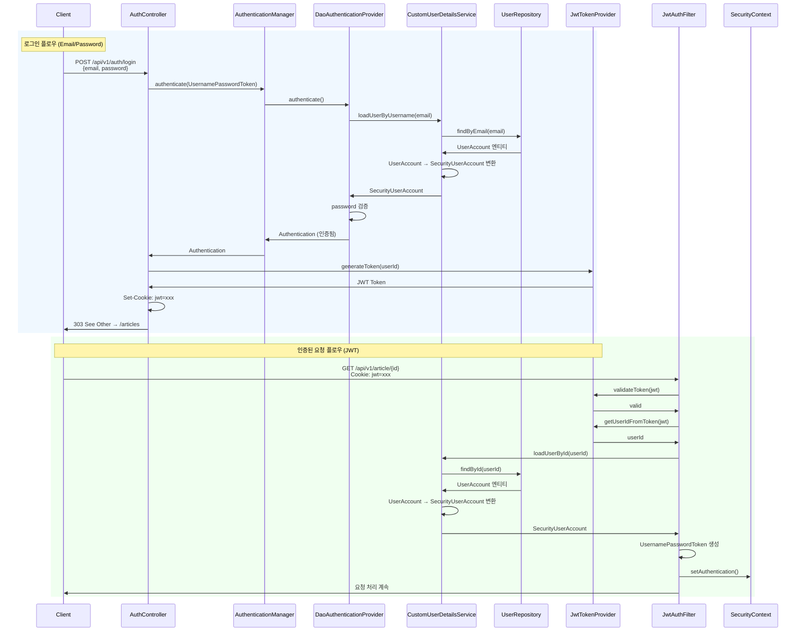
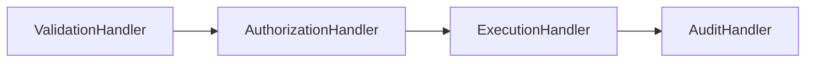

# Spring Boot Article Management REST API

### 주요 기능
- Spring Security + JWT 기반 인증/인가
- 사용자 회원가입 및 로그인/로그아웃
- 사용자 정보 수정 (닉네임, 비밀번호)
- 게시글 CRUD (생성, 조회, 수정, 삭제)
- 댓글 CRUD
- 커서 기반 페이지네이션
- 게시글 좋아요 토글 기능
- Soft Delete 패턴 적용
- Chain of Responsibility + Strategy 패턴을 통한 CASCADE 삭제 처리
- Event-driven 조회수/좋아요 처리

---

## 아키텍처

### 계층 구조



### 패키지 구조

```
ktb
├── auth                   # Spring Security 인증/인가
│   ├── adapter/
│   │   └── SecurityUserAccount     # UserDetails 구현체
│   ├── config/
│   │   └── SecurityConfig          # Security 설정
│   ├── filter/
│   │   ├── JwtAuthenticationFilter # JWT 인증 필터
│   │   └── CsrfDebugFilter         # CSRF 디버그 필터
│   └── service/
│       └── CustomUserDetailService # UserDetailsService 구현
├── controller             # REST API 엔드포인트
│   ├── ArticleController
│   ├── CommentController
│   ├── UserController
│   ├── AuthController
│   ├── CsrfController
│   └── ViewController
├── service                # 비즈니스 로직 (CQS 패턴)
│   ├── ArticleQueryService     # 게시글 조회 (Query)
│   ├── ArticleCommandService   # 게시글 변경 (Command)
│   ├── ArticleService          # 게시글 기본 CRUD
│   ├── ArticleLikeService      # 좋아요 처리
│   ├── ArticleMetaService      # 메타데이터 관리
│   ├── CommentQueryService     # 댓글 조회
│   ├── CommentCommandService   # 댓글 변경
│   ├── CommentService          # 댓글 기본 CRUD
│   ├── UserService             # 사용자 관리
│   └── AuthService             # 인증 서비스
├── handler                # Chain of Responsibility + Strategy 패턴
│   ├── AbstractHandler         # 추상 핸들러 (체인 구성)
│   ├── chain/
│   │   ├── ValidationHandler   # 유효성 검사
│   │   ├── AuthorizationHandler # 권한 검사
│   │   ├── AuditHandler        # 감사 로그
│   │   └── execution/          # 실행 핸들러
│   │       ├── BaseExecutionHandler
│   │       ├── ArticleDeleteExecutionHandler
│   │       ├── CommentDeleteExecutionHandler
│   │       └── UserDeleteExecutionHandler
│   ├── config/
│   │   └── HandlerChainConfig  # 핸들러 체인 설정
│   ├── context/
│   │   ├── ContextData         # 컨텍스트 인터페이스
│   │   ├── SoftDeleteContext   # 소프트 삭제 컨텍스트
│   │   ├── CommentDeleteContext
│   │   └── payload/
│   │       ├── SoftDeletePayload
│   │       └── CommentDeletePayload
│   └── strategy/              # 삭제 전략
│       ├── DeleteExecutionStrategy
│       ├── DeleteStrategyOrder
│       ├── ValidationStrategy
│       ├── AuditStrategy
│       └── impl/
│           ├── SingleArticleDeleteStrategy
│           ├── ArticleCommentsDeleteStrategy
│           ├── SingleCommentDeleteStrategy
│           ├── UserDeleteStrategy
│           ├── UserArticlesDeleteStrategy
│           └── UserCommentsDeleteStrategy
├── repository             # JPA Repository
│   ├── ArticleRepository
│   ├── ArticleCommentRepository
│   ├── ArticleLikeRepository
│   ├── ArticleMetaRepository
│   └── UserRepository
├── domain                 # JPA 엔티티
│   ├── Article
│   ├── ArticleComment
│   ├── ArticleMeta
│   ├── ArticleLike
│   ├── LikeTargetType
│   └── UserAccount
├── dto                    # 데이터 전송 객체
│   ├── request/           # API 요청 DTO
│   │   ├── LoginRequest
│   │   ├── SignupRequest
│   │   ├── ArticleRequest
│   │   ├── ArticlePatchRequest
│   │   ├── CommentRequest
│   │   └── ...
│   └── response/          # API 응답 DTO
│       ├── ArticleDetailDto
│       ├── ArticleSimpleDto
│       ├── ArticlesResponse
│       ├── CommonResponse
│       └── ...
├── event                  # 이벤트 기반 처리
│   ├── article/
│   │   ├── ArticleEventPublisher
│   │   ├── ArticleViewEventListener
│   │   └── ArticleLikeEventListener
│   └── context/
│       ├── ArticleViewEvent
│       └── ArticleLikeEvent
├── exception              # 예외 처리
│   ├── GlobalExceptionHandler
│   ├── AuthenticateException
│   ├── AuthorizationException
│   ├── ConflictDuplicationException
│   ├── article/
│   │   ├── NoExistArticleException
│   │   ├── AlreadyDeletedArticle
│   │   ├── AlreadyDeletedComment
│   │   └── AlreadyDeletedUser
│   ├── user/
│   │   ├── NonExistUserException
│   │   └── MisMatchPasswordException
│   └── filter/
│       └── JsonDeserializationException
├── common                 # 공통 유틸리티
│   └── pagination/
│       ├── Slice
│       └── PageInfo
├── constant               # 상수 관리
│   ├── MessageConstant
│   └── RegexpConstant
├── config                 # 설정
│   ├── JwtConfig
│   └── SecurityProperties    # URL 인증 설정 (permitAll, anonymous)
└── util
    └── JwtTokenProvider   # JWT 토큰 생성/검증
```

### Frontend 구조 (Static Resources)

```
src/main/resources/static
├── fragments/                    # 재사용 HTML 컴포넌트
│   ├── common-meta.html          # 공통 메타 태그
│   ├── header-auth.html          # 인증된 사용자 헤더
│   ├── header-auth-with-back.html
│   ├── header-public.html        # 비인증 사용자 헤더
│   ├── header-with-back.html
│   └── header-with-user-menu.html
├── pages/                        # HTML 페이지
│   ├── article/
│   │   ├── list.html             # 게시글 목록
│   │   ├── detail.html           # 게시글 상세
│   │   └── edit.html             # 게시글 작성/수정
│   └── user/
│       ├── login.html            # 로그인
│       ├── signup.html           # 회원가입
│       ├── edit.html             # 프로필 수정
│       └── password.html         # 비밀번호 변경
└── js/                           # JavaScript 모듈
    ├── api/                      # API 통신 모듈
    │   ├── apiUtils.js           # 공통 API 유틸 (응답 처리)
    │   ├── articleApi.js         # 게시글 API
    │   └── userApi.js            # 사용자 API
    ├── common/                   # 공통 모듈
    │   ├── uris.js               # URI 상수
    │   ├── auth/                 # 인증 관련
    │   │   └── csrf.js           # CSRF 토큰 처리
    │   ├── event/                # 이벤트 관리
    │   │   ├── event.js          # 이벤트 re-export (하위 호환)
    │   │   └── eventManager.js   # 이벤트 리스너 관리
    │   ├── ui/                   # UI 컴포넌트
    │   │   ├── domElements.js    # DOM 요소 관리
    │   │   ├── fragment-loader.js # HTML Fragment 로더
    │   │   ├── headerInit.js     # 헤더 초기화
    │   │   ├── headerLink.js     # 헤더 링크 관리
    │   │   ├── imagePreview.js   # 이미지 미리보기
    │   │   ├── markdownRenderer.js # 마크다운 렌더링
    │   │   ├── modalManager.js   # 모달 관리
    │   │   └── toastManager.js   # 토스트 메시지
    │   └── util/                 # 유틸리티
    │       └── utils.js          # debounce, throttle, formatDate
    ├── handler/                  # 페이지별 핸들러
    │   ├── article/
    │   │   ├── listHandler.js    # 목록 페이지 핸들러
    │   │   ├── detailHandler.js  # 상세 페이지 핸들러
    │   │   └── formHandler.js    # 폼 핸들러
    │   └── user/
    │       ├── loginHandler.js   # 로그인 핸들러
    │       ├── signupHandler.js  # 회원가입 핸들러
    │       └── userEditHandler.js # 프로필 수정 핸들러
    └── styles/                   # CSS-in-JS 스타일
        ├── styleLoader.js        # 스타일 로더
        ├── styleManager.js       # 스타일 매니저
        ├── theme.js              # 테마 설정
        ├── common.styles.js      # 공통 스타일
        ├── article.styles.js     # 게시글 스타일
        └── user.styles.js        # 사용자 스타일
```

---

## Class Diagrams

### Article Flow Diagram



### Comment Flow Diagram



### User Flow Diagram



### Authentication Flow Diagram



**JwtTokenProvider** (`ktb.util.JwtTokenProvider`)
- JWT 토큰 생성, 검증, 파싱
- 쿠키 설정/만료 처리

## 핵심 설계 특징

### 1. Spring Security + JWT 인증

Cookie 기반 JWT 인증을 사용합니다:

- **JwtAuthenticationFilter**: 요청마다 JWT 토큰 검증
- **JwtTokenProvider**: 토큰 생성, 검증, 파싱
- **CustomUserDetailService**: UserDetailsService 구현
- **SecurityUserAccount**: UserDetails 어댑터

**인증 흐름**:
1. 로그인 시 AuthenticationManager를 통해 인증
2. 인증 성공 시 JWT 생성 후 쿠키에 설정
3. 이후 요청은 JwtAuthenticationFilter에서 토큰 검증

### 2. CQS (Command Query Separation) 패턴

서비스 계층에서 읽기와 쓰기 작업을 분리합니다:

- **Query Service**: 조회 전용 (`@Transactional(readOnly = true)`)
  - `ArticleQueryService`, `CommentQueryService`
- **Command Service**: 변경 전용 (`@Transactional`)
  - `ArticleCommandService`, `CommentCommandService`

### 3. Chain of Responsibility + Strategy 패턴

삭제 처리를 위한 유연한 핸들러 체인:



**삭제 전략 (Strategy)**:
- `SingleArticleDeleteStrategy`: 게시글 단일 삭제
- `ArticleCommentsDeleteStrategy`: 게시글의 댓글 일괄 삭제
- `UserDeleteStrategy`: 사용자 삭제
- `UserArticlesDeleteStrategy`: 사용자의 게시글 일괄 삭제
- `UserCommentsDeleteStrategy`: 사용자의 댓글 일괄 삭제

**참고**: `ktb.handler.AbstractHandler`, `ktb.handler.config.HandlerChainConfig`

### 4. Event-driven 조회수/좋아요 처리

Spring Event를 사용하여 조회수, 좋아요 처리를 비동기로 분리:

- `ArticleEventPublisher`: 이벤트 발행
- `ArticleViewEventListener`: 조회수 증가 처리
- `ArticleLikeEventListener`: 좋아요 처리

### 5. Soft Delete 패턴

모든 엔티티에 Soft Delete 적용:

- `isDeleted`: 삭제 여부 플래그
- `deleteAt`: 삭제 시간
- `softDelete()`, `softRestore()` 메서드

### 6. 커서 기반 페이지네이션

오프셋 방식 대신 커서 기반 페이지네이션:

- `Slice<T>`: 페이징된 결과와 메타데이터
- `PageInfo`: 커서 ID, 다음 페이지 존재 여부

**참고**: `ktb.common.pagination.Slice`

---

## API 엔드포인트

### 인증

| Method | Endpoint             | Description      |
|--------|----------------------|------------------|
| POST   | `/api/v1/auth/login` | 로그인 (JWT 쿠키 발급) |
| POST   | `/api/v1/auth/logout`| 로그아웃 (쿠키 만료)   |

### 사용자

| Method | Endpoint                     | Description     |
|--------|------------------------------|-----------------|
| POST   | `/api/v1/users/signup`       | 회원가입          |
| GET    | `/api/v1/users/me`           | 내 정보 조회       |
| PATCH  | `/api/v1/users/me/nickName`  | 닉네임 변경        |
| PATCH  | `/api/v1/users/me/password`  | 비밀번호 변경       |
| DELETE | `/api/v1/users/me`           | 회원 탈퇴          |
| POST   | `/api/v1/users/exist/nickname` | 닉네임 중복 확인  |
| POST   | `/api/v1/users/exist/email`  | 이메일 중복 확인    |

### 게시글

| Method | Endpoint               | Description              |
|--------|------------------------|--------------------------|
| GET    | `/api/v1/articles`     | 게시글 목록 조회 (커서 페이지네이션) |
| POST   | `/api/v1/article`      | 게시글 작성                 |
| GET    | `/api/v1/article/{id}` | 게시글 상세 조회             |
| PATCH  | `/api/v1/article/{id}` | 게시글 수정                 |
| DELETE | `/api/v1/article/{id}` | 게시글 삭제 (Soft Delete)   |
| POST   | `/api/v1/article/{id}/like` | 좋아요 토글            |

### 댓글

| Method | Endpoint                         | Description |
|--------|----------------------------------|-------------|
| POST   | `/api/v1/article/{id}/comments`  | 댓글 작성     |
| PUT    | `/api/v1/article/{id}/comments`  | 댓글 수정     |
| DELETE | `/api/v1/article/{id}/comments`  | 댓글 삭제     |

---

## 주요 클래스 설명

### Domain Layer

**Article** (`ktb.domain.Article`)
- JPA 엔티티, 게시글 정보
- `@ManyToOne` UserAccount (작성자)
- `@OneToOne` ArticleMeta (메타데이터)
- `@OneToMany` ArticleComment (댓글)
- Soft Delete 지원 (`softDelete()`, `isDelete()`)

**ArticleMeta** (`ktb.domain.ArticleMeta`)
- 게시글 메타데이터 (조회수, 좋아요, 댓글 수)
- 생성/수정 시간 관리

**UserAccount** (`ktb.domain.UserAccount`)
- 사용자 계정 정보
- BCrypt 암호화된 비밀번호
- Soft Delete 지원

### Handler Layer

**AbstractHandler** (`ktb.handler.AbstractHandler`)
- Chain of Responsibility 패턴 구현
- `chainOf()` 메서드로 체인 구성
- 제네릭 컨텍스트 지원

**DeleteExecutionStrategy** (`ktb.handler.strategy.DeleteExecutionStrategy`)
- Strategy 패턴 인터페이스
- 다양한 삭제 전략 구현체 제공

### Auth Layer

**JwtTokenProvider** (`ktb.util.JwtTokenProvider`)
- JWT 토큰 생성, 검증, 파싱
- 쿠키 설정/만료 처리

**JwtAuthenticationFilter** (`ktb.auth.filter.JwtAuthenticationFilter`)
- OncePerRequestFilter 확장
- 요청마다 JWT 검증 및 SecurityContext 설정

---

## 기술 스택

- **Java**: 17
- **Spring Boot**: 3.2.5
- **Spring Security**: JWT + Cookie 기반 인증
- **Spring Data JPA**: Hibernate ORM
- **Swagger/OpenAPI**: API 문서화
- **Lombok**: 보일러플레이트 코드 감소
- **Gradle**: 빌드 도구

---
