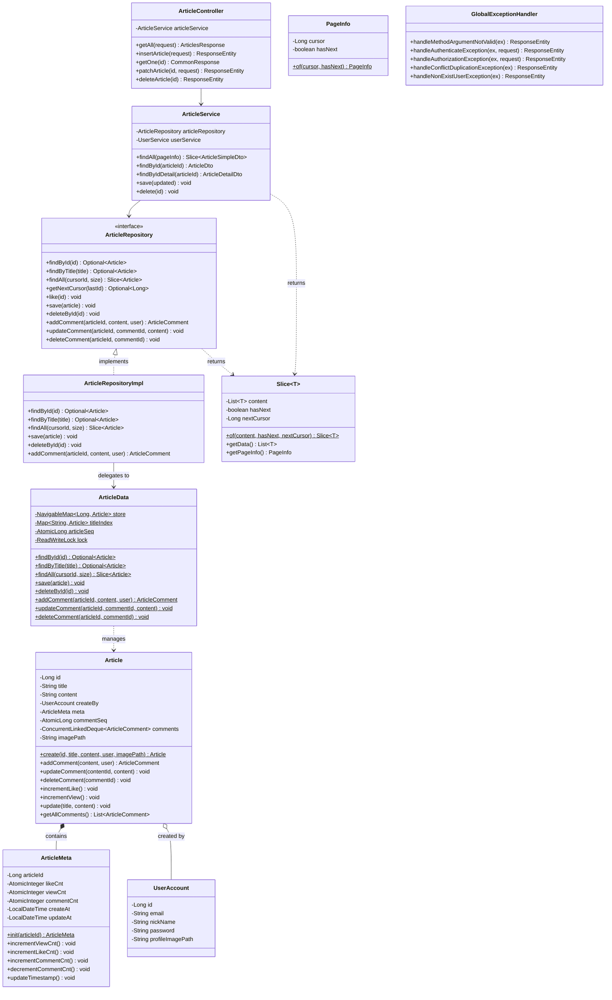
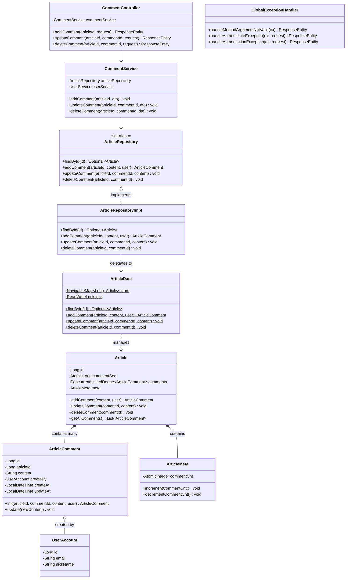
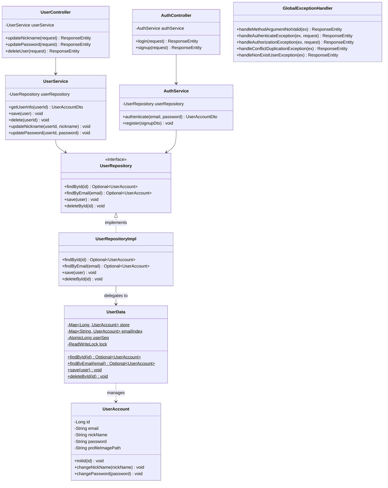

# Spring Boot Article Management REST API

### 주요 기능
- 사용자 인증 및 회원가입 
- 게시글 CRUD (생성, 조회, 수정, 삭제)
- 댓글 CRUD
- 커서 기반 페이지네이션
- 게시글 조회수 및 좋아요 기능
- Thread-safe 동시성 처리

---

## 아키텍처

### 계층 구조

```
┌─────────────────────────────────────┐
│     Controller Layer (REST API)     │
│   ArticleController, AuthController │
└──────────────┬──────────────────────┘
               │
┌──────────────▼──────────────────────┐
│         Service Layer               │
│  ArticleService, UserService, etc.  │
└──────────────┬──────────────────────┘
               │
┌──────────────▼──────────────────────┐
│       Repository Layer              │
│  ArticleRepository, UserRepository  │
└──────────────┬──────────────────────┘
               │
┌──────────────▼──────────────────────┐
│    Data Store Layer (Static)        │
│   ArticleData (ConcurrentSkipListMap)│
│   UserData (ConcurrentHashMap)      │
└──────────────┬──────────────────────┘
               │
┌──────────────▼──────────────────────┐
│         Domain Layer                │
│  Article, UserAccount, Comment      │
└─────────────────────────────────────┘
```

### 패키지 구조

```
ktb
├── controller          # REST API 엔드포인트
│   ├── ArticleController
│   ├── CommentController
│   ├── UserController
│   └── AuthController
├── service            # 비즈니스 로직
│   ├── ArticleService
│   ├── CommentService
│   ├── UserService
│   └── AuthService
├── repository         # 데이터 접근 인터페이스
│   ├── ArticleRepository
│   ├── UserRepository
│   └── impl/          # 구현체
├── db                 # Static In-Memory 데이터 저장소
│   ├── article/
│   │   └── ArticleData
│   └── user/
│       └── UserData
├── domain             # 도메인 엔티티
│   ├── Article
│   ├── ArticleComment
│   ├── ArticleMeta
│   └── UserAccount
├── dto                # 데이터 전송 객체
│   ├── request/       # API 요청 값, Request에서 데이터 검증 진행
│   └── response/      # API 응답 값
├── exception          # 예외 처리
│   └── GlobalExceptionHandler
├── common             # 공통 유틸리티
│   └── pagination/
│       ├── Slice
│       └── PageInfo
├── constant           # 상수 관리
│   ├── MessageConstant
│   └── RegexpConstant
└── config             # 설정
    └── TestDataInitializer
```

---

## Class Diagrams

### Article Flow Diagram



### Comment Flow Diagram



### User Flow Diagram



---

## 핵심 설계 특징

### 1. In-Memory 동시성 데이터 저장소

데이터베이스 대신 정적 자료구조를 사용하여 데이터를 관리합니다:

- **ConcurrentSkipListMap**: 정렬된 순서를 유지하면서 동시성 접근 지원
- **ReadWriteLock**: 다중 읽기 또는 단일 쓰기 락 패턴 적용
- **AtomicLong**: ID 자동 생성 및 카운터 관리
- **보조 인덱스**: 제목 기반 조회를 위한 `titleIndex` 관리

**예시: ArticleData.java**
```java
private static final NavigableMap<Long, Article> store = new ConcurrentSkipListMap<>();
private static final Map<String, Article> titleIndex = new ConcurrentHashMap<>();
private static final AtomicLong articleSeq = new AtomicLong(0);
private static final ReadWriteLock lock = new ReentrantReadWriteLock();
```

### 2. 커서 기반 페이지네이션

오프셋 방식 대신 커서 기반 페이지네이션을 구현하여 안정적인 페이징을 제공합니다:

- `Slice<T>`: 페이징된 결과와 메타데이터 포함
- `PageInfo`: 커서 ID, 크기, 다음 페이지 존재 여부 관리
- 대규모 데이터셋에서도 일관된 성능 보장

**참고**: `ktb.common.pagination.Slice`, `ArticleData.java:61-84`

### 3. 전역 예외 처리

`GlobalExceptionHandler`를 통해 일관된 에러 응답 제공:

- `AuthenticateException` → 401 Unauthorized
- `AuthorizationException` → 403 Forbidden
- `ConflictDuplicationException` → 409 Conflict
- `NonExistUserException` → 404 Not Found
- 보안 관련 예외 발생 시 클라이언트 IP 및 요청 URI 로깅

**참고**: `ktb.exception.GlobalExceptionHandler`

---

## API 엔드포인트

### 게시글 관리

| Method | Endpoint        | Description           |
|--------|-----------------|-----------------------|
| GET    | `/articles`     | 게시글 목록 조회 (커서 페이지네이션) |
| POST   | `/article`      | 게시글 작성                |
| GET    | `/article/{id}` | 게시글 상세 조회             |
| PATCH  | `/article/{id}` | 게시글 수정                |
| DELETE | `/article/{id}` | 게시글 삭제                |

### 댓글 관리

| Method | Endpoint                                   | Description |
|--------|--------------------------------------------|-------------|
| POST   | `/article/{articleId}/comment`             | 댓글 작성       |
| PUT    | `/article/{articleId}/comment/{commentId}` | 댓글 수정       |
| DELETE | `/article/{articleId}/comment/{commentId}` | 댓글 삭제       |

### 인증 및 사용자

| Method | Endpoint          | Description |
|--------|-------------------|-------------|
| POST   | `/login`          | 로그인         |
| POST   | `/users/signup`   | 회원가입        |
| PATCH  | `/users/nickname` | 닉네임 변경      |
| PATCH  | `/users/password` | 비밀번호 변경     |
| DELETE | `/users/password` | 유저 삭제       |

---

## 주요 클래스 설명

### Domain Layer

**Article** (`ktb.domain.Article`)
- 게시글 엔티티
- 댓글 관리 (`ConcurrentLinkedDeque`)
- 메타데이터 관리 (조회수, 좋아요, 댓글 수)
- Thread-safe 댓글 추가/수정/삭제 메서드 제공

**ArticleMeta** (`ktb.domain.ArticleMeta`)
- 게시글 메타데이터 (조회수, 좋아요, 댓글 수)
- `AtomicLong` 사용으로 동시성 보장

**UserAccount** (`ktb.domain.UserAccount`)
- 사용자 계정 정보 관리

### Data Store Layer

**ArticleData** (`ktb.db.article.ArticleData`)
- 정적 In-Memory 게시글 저장소
- `ReadWriteLock`을 통한 동시성 제어
- 커서 기반 페이지네이션 구현
- 제목 기반 보조 인덱스 관리

**UserData** (`ktb.db.user.UserData`)
- 정적 In-Memory 사용자 저장소
- ID 및 이메일 기반 조회 지원

### Common Utilities

**Slice** (`ktb.common.pagination.Slice`)
- 커서 기반 페이지네이션 결과 래퍼
- 데이터, 다음 커서, 페이지 존재 여부 포함

---

## 동시성 처리

### Lock 전략

- **ReadLock**: 조회 작업 시 여러 스레드 동시 접근 허용
- **WriteLock**: 생성/수정/삭제 작업 시 단일 스레드만 접근

### Atomic 연산


각 엔티티의 Sequential ID 는 `AtomicLong` 사용:
 - 생성/삭제의 경우 Lock 으로 동시성 처리하여 Atomic 만 적용

```java
private static final AtomicLong articleSeq = new AtomicLong(0);
Long newId = articleSeq.incrementAndGet();
```

---