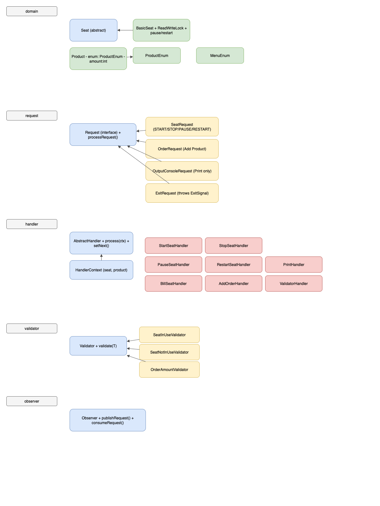
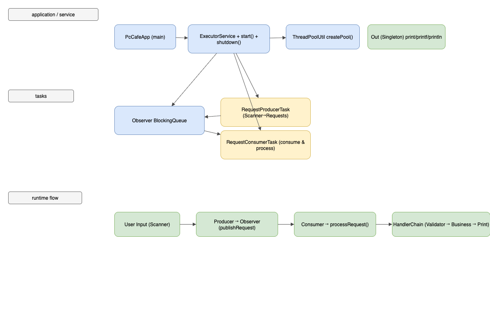

# 📖 PC방 좌석 & 주문 관리 CLI 프로그램

## 📌 소개
이 프로젝트는 **PC방 좌석 관리와 주문(음료, 커피, 컵라면 등)** 기능을 지원하는 **CLI 프로그램**입니다.  
주요 기능은 다음과 같습니다:
- 좌석 시작 / 종료
- 좌석별 사용 시간 및 요금 계산
- 주문 추가 (음료, 커피, 컵라면 등)
- 모든 좌석 상태 확인 (사용 중/빈 좌석, 주문 내역)
- 사용 일시 중지
- 좌석 이동
 
`StringConstant`, `ConfigConstant`를 통해 상수를 관리합니다.

---

## 📌 프로젝트 구조
```
src
├── application
│   └── PcCafeApp.java
├── constants
│   ├── ConfigConstant.java
│   └── StringConstant.java
├── domain
│   ├── menu
│   │   └── MenuEnum.java
│   ├── product
│   │   ├── Product.java
│   │   └── ProductEnum.java
│   └── seat
│       ├── Seat.java
│       └── BasicSeat.java
├── exception
│   ├── ExitSignalException.java
│   └── ValidationException.java
├── handler
│   ├── AbstractHandler.java
│   ├── HandlerContext.java
│   ├── BillSeatHandler.java
│   ├── StartSeatHandler.java
│   ├── StopSeatHandler.java
│   ├── PauseSeatHandler.java
│   ├── RestartSeatHandler.java
│   ├── AddOrderHandler.java
│   ├── ValidatorHandler.java
│   └── PrintHandler.java
├── observer
│   └── Observer.java
├── request
│   ├── Request.java
│   ├── OutputConsoleRequest.java
│   ├── SeatRequest.java
│   ├── OrderRequest.java
│   └── ExitRequest.java
├── service
│   └── ExecutorService.java
├── task
│   ├── RequestProducerTask.java
│   └── RequestConsumerTask.java
├── validator
│   ├── Validator.java
│   ├── SeatInUseValidator.java
│   ├── SeatNotInUseValidator.java
│   └── OrderAmountValidator.java
└── util
    ├── Out.java
    └── ThreadPoolUtil.java
```

--------

---

## 📌 UML 다이어그램

### 📂 Domain 구조


### 📂 Application 구조


---

## 📌 주요 클래스 설명

### 📂 application
- **PcCafeApp**
  - 메인 실행 클래스
  - ExecutorService를 통해 프로그램 시작

---

### 📂 constants
- **ConfigConstant**
  - 좌석 요금 단가, 시간 단위 등 환경 설정 상수
- **StringConstant**
  - 프로그램 내 모든 출력 문자열을 상수로 관리

---

### 📂 domain
- **Seat (추상 클래스)**
  - 좌석 번호, 사용 여부, 요금 계산 및 상태 제어 메서드 정의
- **BasicSeat**
  - 실제 좌석 구현체
  - 주문 가능, 시간 기반 요금 계산
  - ReadWriteLock 적용 → Thread-safe 보장
- **Product**
  - 상품명, 가격, 수량을 관리
- **ProductEnum**
  - 메뉴 정보와 가격 정의
- **MenuEnum**
  - 사용자 입력 메뉴 번호와 설명 매핑

---

### 📂 exception
- **ExitSignalException**
  - ExitRequest 실행 시 throw 되는 종료 신호 예외 (미 구현)
- **ValidationException**
  - 입력값 검증 실패 시 발생하는 예외

---

### 📂 handler
- **AbstractHandler**
  - Chain of Responsibility 패턴 기반 목적 추상화 클래스
- **HandlerContext**
  - Handler 실행 시 필요한 Seat, Product 정보 컨텍스트
- **StartSeatHandler / StopSeatHandler / PauseSeatHandler / RestartSeatHandler**
  - 좌석 관련 비즈니스 로직 실행
- **BillSeatHandler**
  - 좌석 정산 로직 수행 (좌석 요금 + 주문 요금)
- **AddOrderHandler**
  - 상품 주문 처리
- **ValidatorHandler**
  - Validator와 연결하여 입력값 검증 수행
- **PrintHandler**
  - Console 출력 수행

---

### 📂 observer
- **Observer**
  - BlockingQueue 기반 Request 발행/소비 관리

---

### 📂 request
- **Request (인터페이스)**
  - 모든 요청의 공통 인터페이스
  - `processRequest()` 정의
- **SeatRequest**
  - 좌석 관련 요청 처리 (START, STOP, PAUSE, RESTART)
  - 내부적으로 HandlerChain 실행
- **OrderRequest**
  - 주문 관련 요청 처리
- **OutputConsoleRequest**
  - 단순 출력 요청 처리
- **ExitRequest**
  - 프로그램 종료 요청 (ExitSignalException throw)

---

### 📂 service
- **ExecutorService**
  - ThreadPoolExecutor 생성 및 관리
  - Observer, Producer, Consumer 실행

---

### 📂 task
- **RequestProducerTask**
  - Scanner로 사용자 입력을 받고 Request 생성
  - Observer에 Request publish
- **RequestConsumerTask**
  - Observer에서 Request를 가져와 실행
  - ExitSignalException 발생 시 종료 (미 구현)

---

### 📂 validator
- **Validator (추상 클래스)**
  - 입력값 검증의 기본 틀 제공
- **SeatInUseValidator / SeatNotInUseValidator**
  - 좌석 상태 검증
- **OrderAmountValidator**
  - 주문 수량 검증

---

### 📂 util
- **Out**
  - Console 출력 담당 싱글톤
  - synchronized → 멀티스레드 환경에서도 출력 순서 보장
- **ThreadPoolUtil**
  - ThreadPoolExecutor 생성 유틸리티

---

## 📌 실행 예시


```
=== PC방 관리 프로그램 ===
1: 좌석 사용 시작  2: 주문 추가  3: 좌석 사용 종료  4: 좌석 일시 중지  5: 재시작  6: 좌석 현황 보기  7: 종료
선택: 1
좌석 번호를 입력하세요 (1 ~ 5): 1
좌석 사용을 시작했습니다.

1: 좌석 사용 시작  2: 주문 추가  3: 좌석 사용 종료  4: 좌석 일시 중지  5: 재시작  6: 좌석 현황 보기  7: 종료
선택: 2
좌석 번호를 입력하세요 (1 ~ 5): 1

=== 주문 메뉴 ===
1: 음료 2000원
2: 커피 4000원
3: 컵라면 3500원
선택: 1
수량을 입력하세요: 3
주문이 추가되었습니다.

1: 좌석 사용 시작  2: 주문 추가  3: 좌석 사용 종료  4: 좌석 일시 중지  5: 재시작  6: 좌석 현황 보기  7: 종료
선택: 4
좌석 1 : 사용 중 | 주문: 음료 x3 (6000원)
좌석 2 : 빈 좌석 | 주문: 없음
좌석 3 : 빈 좌석 | 주문: 없음
좌석 4 : 빈 좌석 | 주문: 없음
좌석 5 : 빈 좌석 | 주문: 없음

1: 좌석 사용 시작  2: 주문 추가  3: 좌석 사용 종료  4: 좌석 일시 중지  5: 재시작  6: 좌석 현황 보기  7: 종료
선택: 1
좌석 번호를 입력하세요 (1 ~ 5): 3
좌석 사용을 시작했습니다.

1: 좌석 사용 시작  2: 주문 추가  3: 좌석 사용 종료  4: 좌석 일시 중지  5: 재시작  6: 좌석 현황 보기  7: 종료
선택: 1
좌석 번호를 입력하세요 (1 ~ 5): 1
이미 사용 중인 좌석입니다.

1: 좌석 사용 시작  2: 주문 추가  3: 좌석 사용 종료  4: 좌석 일시 중지  5: 재시작  6: 좌석 현황 보기  7: 종료
선택: 4
좌석 1 : 사용 중 | 주문: 음료 x3 (6000원)
좌석 2 : 빈 좌석 | 주문: 없음
좌석 3 : 사용 중 | 주문: 없음
좌석 4 : 빈 좌석 | 주문: 없음
좌석 5 : 빈 좌석 | 주문: 없음

1: 좌석 사용 시작  2: 주문 추가  3: 좌석 사용 종료  4: 좌석 일시 중지  5: 재시작  6: 좌석 현황 보기  7: 종료
선택: 3
좌석 번호를 입력하세요 (1 ~ 5): 1
좌석 0 요금: 12300원
요금 정산이 완료되었습니다.

1: 좌석 사용 시작  2: 주문 추가  3: 좌석 사용 종료  4: 좌석 일시 중지  5: 재시작  6: 좌석 현황 보기  7: 종료
선택: 3
좌석 번호를 입력하세요 (1 ~ 5): 1
해당 좌석은 사용 중이 아닙니다.
1: 좌석 사용 시작  2: 주문 추가  3: 좌석 사용 종료  4: 좌석 일시 중지  5: 재시작  6: 좌석 현황 보기  7: 종료
선택: 3
좌석 번호를 입력하세요 (1 ~ 5): 3
좌석 2 요금: 200원
요금 정산이 완료되었습니다.

1: 좌석 사용 시작  2: 주문 추가  3: 좌석 사용 종료  4: 좌석 일시 중지  5: 재시작  6: 좌석 현황 보기  7: 종료
선택: d
잘못된 입력입니다.
1: 좌석 사용 시작  2: 주문 추가  3: 좌석 사용 종료  4: 좌석 일시 중지  5: 재시작  6: 좌석 현황 보기  7: 종료
선택: 5
프로그램을 종료합니다.
```
